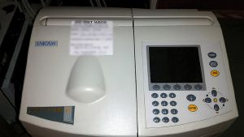

==========================================
LBL04001 - Operating the Spectrophotometer
==========================================

+----------------------+----------------------------+--------------------+
| Author: Tom Hodder   | Approved by: S. Thompson   | SOP No. LBL04001   |
+----------------------+----------------------------+--------------------+
| Signed:              | Signed:                    | Effective from:    |
+----------------------+----------------------------+--------------------+
| Date:                | Date:                      | Last edited:       |
+----------------------+----------------------------+--------------------+

Purpose
=======
The following document describes the procedure for the operation
of the UNICAM Helios Beta Spectrophometer.

|14794946891_a616cdbabe_z.jpg|

Scope
=====
This instrument is used to meaure how much light is absorbed by a
liquid sample. In full working condition this instrument supports
a range of visible and UV wavelengths of light.

Responsibilities
================
-  It is the responsibility of lab users to use this equipment in the
   manner described in this SOP.
-  It is the responsibility of lab users to report any incidents or
   technical problems with the equipment
-  It is the responsibility of the lab management to provide
   training, technical support and to ensure compliance with the
   operating procedures.

Materials
=========
-  Quartz or plastic cuvettes with a optical path of 12mm
-  The equipment has replaceable UV and visible light bulbs

Definitions
===========
Cuvette
	A small, transparent quartz vessel into which a sample is placed for testing in the UV - Visible Spectrophotometer.

Procedures
==========
#. The spectrophotometer should be started with good time before it's required as the initialization procedure takes ~15 mins.
#. The user should ensure that the sample cuvette is clean before it is inserted into the device.
#. For OD600 select a wavelength for 600nm.
#. run a reference sample of media only sample.
#. run the sample cuvette.
#. ensure the machine is switched off after use.

Resources
=========
| London Hackspace wiki - Spectrophotometer:
| https://wiki.london.hackspace.org.uk/view/Spectrophotometer

| Unicam UV Series Software manual:
| http://www.vtpup.cz/common/manual/PrF_biofyz_ThermoSpectronic_UV500_manual_EN.pdf

| Thermo Scientific - Spectrophotometer User Guide:
| https://extranet.fisher.co.uk/webfiles/fr/Pjointes/Mdemploi/UNI050_EN%202203_%20HELIOS%20SERIES_%20USER.pdf