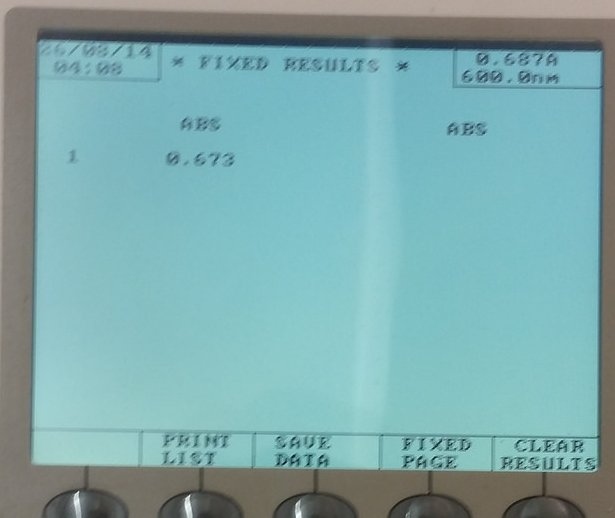
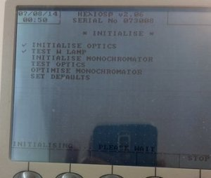
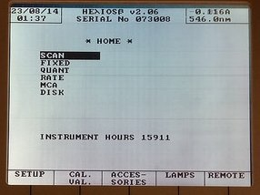

==========================================
LBL04001 - Operating the Spectrophotometer
==========================================

+----------------------+----------------------------+--------------------+
| Author: Tom Hodder   | Approved by: S. Thompson   | SOP No. LBL04001   |
+----------------------+----------------------------+--------------------+
| Signed:              | Signed:                    | Effective from:    |
+----------------------+----------------------------+--------------------+
| Date:                | Date:                      | Last edited:       |
+----------------------+----------------------------+--------------------+

Purpose
=======
The following document describes the procedure for the operation
of the UNICAM Helios Beta Spectrophometer. This instrument is used to meaure 
how much light is absorbed by a liquid sample. This 
instrument supports a range of visible and UV wavelengths of light.

|14794946891_a616cdbabe_z.jpg|

Scope
=====

This should be observed every time the Spectrophotometer is used within the LBL BioLab with GMO and non-GMO samples.

Responsibilities
================
-  It is the responsibility of lab users to use this equipment in the manner described in this SOP.
-  This machine emits UV light. The operator should ensure that the cover is down and any access hatches are closed and secure.
-  Parts of the machine can get hot. The user should be aware of this and take precautions.

Suitable hand and eye protection should be worn.

Materials
=========

This machine usese Quartz or plastic **cuvettes** with a optical path of 12mm.

The equipment has replaceable UV and visible light bulbs. If either of the bulbs are not functional please email 
`BSO <hello@biohackspace.org>`__ and report the situation.

Definitions
===========
Cuvette
	A small, transparent vessel into which a sample is placed for testing in the UV/Visible Spectrophotometer.

Procedures
==========
1. The spectrophotometer should be started with good time before it's required as the initialization procedure takes ~15 mins.

|14848339375_cbdc28a2e6_z.jpg|

2. The user should ensure that the sample cuvette is clean before it is inserted into the device.
3. For OD600 select a FIXED scan type

|14981898526_ba6f7f597e_z.jpg|

4. Set the wavelength for 600nm.
5. Run a reference sample containing a media-only sample.
6. run the sample cuvette.

|15039312002_d6c95e29b8_k.jpg|

7. ensure the machine is switched off after use.

.. |14794946891_a616cdbabe_z.jpg| image:: images/14794946891_a616cdbabe_z.jpg
   :target: /view/File:14794946891 a616cdbabe z.jpg

Resources
=========
| London Hackspace wiki - Spectrophotometer:
| https://wiki.london.hackspace.org.uk/view/Spectrophotometer

| Unicam UV Series Software manual:
| http://www.vtpup.cz/common/manual/PrF_biofyz_ThermoSpectronic_UV500_manual_EN.pdf

| Thermo Scientific - Spectrophotometer User Guide:
| https://extranet.fisher.co.uk/webfiles/fr/Pjointes/Mdemploi/UNI050_EN%202203_%20HELIOS%20SERIES_%20USER.pdf
