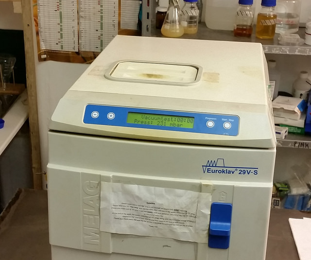
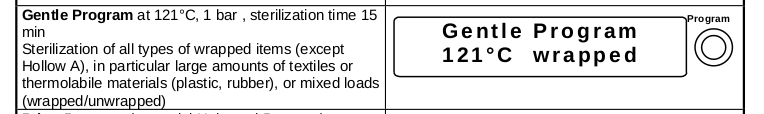
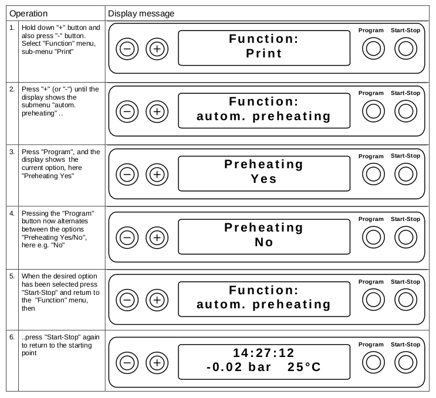

====================================================
LBL04002 - Using the Autoclave for Media Preparation
====================================================

+----------------------+----------------------------+--------------------+
| Author: Tom Hodder   | Approved by: S. Thompson   | SOP No. LBL04002   |
+----------------------+----------------------------+--------------------+
| Signed:              | Signed:                    | Effective from:    |
+----------------------+----------------------------+--------------------+
| Date:                | Date:                      | Last edited:       |
+----------------------+----------------------------+--------------------+

Purpose
=======
   
This describes the operation of the Melag EuroKlav 29V-S with regard to 
the preparation of microbial culture media.

|16350312215_9f5655c920_z.jpg|

Scope
=====

This should be observed every time the autoclave is used within the LBL 
BioLab for media preparation.

Responsibilities
================

The operator of the autoclave is responsible for their own safety and that of others in the vicinity during its use. The particular risks presented in using this piece of equipment are primarily due to the high temperatures generated, steam and high pressures.  There is also a risk of the shattering of sealed glass containers if air is trapped.

The operator is responsible for ensuring complete sterilization of containers, glassware, tubes, media and equipment. To ensure environmental microbes do not contaminate the target microbe strain.

Related documents
=================
| `lbl08002 - Topping up the RO water level in the Autoclave <lbl08002.rst>`__ 

Materials
=========

The main consumables for the autoclave are RO water and autoclave tape.

RO water needs to be regularly topped up, into the hatch on the top of the machine.

The autoclave tape should be used to seal items to be sterilized and is stored on the shelf nearby. Order replacement from `Sigma <https://www.sigmaaldrich.com/catalog/product/aldrich/br61750?lang=en&region=GB>`__ [#]_ or appropriate similar product.

.. [#] https://www.sigmaaldrich.com/catalog/product/aldrich/br61750?lang=en&region=GB

Procedures
==========

Sterilization of liquid media <1L volumes
-----------------------------------------

For sterilization of liquid media up to 1 litre, that requires 15 minutes @ 15 psi and 121 C, please use the “Gentle Programme”;

|Screenshot-gentle-programme.png|

Sterilization of liquid media >1L volumes
-----------------------------------------

For sterilization of liquid media of greater volumes than 1 litre, you need to
preheat the autoclave and place the material to be sterilized in the autoclave
15 minutes before starting the programme.  This is to ensure that the bulk
volume of liquid comes up to temperature in time for the main sterilization
phase.

|Screenshot-preheat.png|

Then run for 15 minutes @ 15 psi and 121 C using the "Gentle Programme":

|Screenshot-gentle-programme.png|

Resources
=========

| Melag EuroKlav Operating manual:
| http://www.eickemeyer.nl/images/products/2281/500032_Melag_Euroklav_23VS.pdf

| PhytoTechnology Laboratories - Sterilizing Nutrient Media:
| http://www.phytotechlab.com/pdf/SterilizingNutrientMedia.pdf

