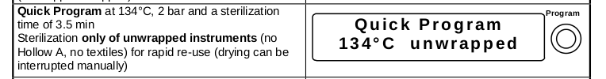
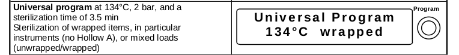

=====================================================
LBL04006 - Using the Autoclave for Waste Deactivation
=====================================================

+-------------------+----------------------------+--------------------+
| Author: Tolland   | Approved by: S. Thompson   | SOP No. LBL04006   |
+-------------------+----------------------------+--------------------+
| Signed:           | Signed:                    | Effective from:    |
+-------------------+----------------------------+--------------------+
| Date:             | Date:                      | Last edited:       |
+-------------------+----------------------------+--------------------+

Purpose
=======
This describes the operation of the Melag EuroKlav
29V-S. The autoclave is used for three main procedures with respect to
GMO deactivation:

i) sterilization of glassware and equipment for reuse
ii) Deactivation of small volumes of liquid and solid media
iii) Deactivation of large loads of  liquid and solid media

Scope
=====
This should be observed every time the autoclave is used within the LBL
BioLab for GMO waste deactivation.

Responsibilities
================
The operator of the autoclave is responsible for their own safety and
that of others in the vicinity during its use. The particular risks
presented in using this piece of equipment are primarily due to the high
temperatures and steam released during evacuation.

Upon removal of items from the autoclave be aware that they will likely
still be hot, and care should be taken to check that glass or ceramic
items are intact.

Materials
=========
The autoclave requires a supply of **RO water**. If the water supply
level falls below a minimum level, the operator will be required to top
up the system. The RO water is available from the tank under the
counter. The autoclave is filled into the tank from the top of the
machine.

The daily test, and waste deactivation runs of the autoclave require
**autoclave tape**. If we are out of autoclave tape, please email the
[mailti:hello@biohackspace.org BSO] and report that we are out of stock.

Procedures
==========

Daily Test procedure
--------------------

Before using the autoclave for GMO deactivation each day, the operator
should run a test strip through the autoclave to check that it is
working to specification.

The test strip should be stapled into the lab book, with a note
indicating the operator and the date/time the test was run, along with
any observations.

Unwrapped equipment and glassware with no internal cavities can be
sterilized using the Quick Programme (28 psi/134 C/3 mins)

|Screenshot-quick-programme.png|

Materials such as a solid and liquid media can be sterilized using
the Universal Programme (28 psi/134 C/30 mins)

|Screenshot-universal-programme.png|

Large volumes of liquid or solid media should be processed with
extra care.

The autoclave should be preheated;

|Screenshot-preheat.png|

If possible, the media should be split into several autoclaves sessions.
The load should be run under the Universal programme

|Screenshot-universal-programme.png|

Deactivation of liquid and solid GMO waste
------------------------------------------
- Transport the waste to the autoclave in a non-drip autoclavable tray
- Ensure there are no folds or containers which can trap air
- Sterilize the load using the Universal-Programme (2.1 bar/134 C/15 mins)
- once the programme has run, the waste should be transferred to the chemical kill bin, for final deactivation

Resources
=========
| Melag EuroKlav Operating manual:
| http://www.eickemeyer.nl/images/products/2281/500032_Melag_Euroklav_23VS.pdf

.. |Screenshot-preheat.png| image:: images/Screenshot-preheat.png
   :target: /view/File:Screenshot-preheat.png
