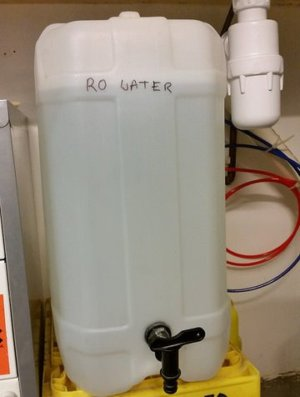

===============================================
LBL08002 - Topping up RO water in the Autoclave
===============================================

+----------------------------+--------------------+
| Approved by: S. Thompson   | SOP No. LBL08002   |
+----------------------------+--------------------+
| Signed:                    | Effective from:    |
+----------------------------+--------------------+
| Date:                      | Last edited:       |
+----------------------------+--------------------+

Purpose 
=======
This describes a user maintainance procedure for the Melag EuroKlav 29V-S.

|16350312215_9f5655c920_z.jpg|

Scope
=====
This should be observed every time the autoclave indicates it requires a water fill top up.

Responsibilities
================
Care should be taken to not splash water when filling.

The machine itself may be hot and steam released when opening the top vent.
Gloves and eye protection should be worn when performing maintenance on the autoclave.

Materials
=========
The autoclave requires a supply of **RO water**. If the water supply level falls below a minimum level, the operator will be required to top up the system. The RO water is available from the tank under the counter. The autoclave is filled into the tank from the top of the machine.

If there are any problems, please email for `biolab support <mailto:hello@biohackspace.org>`__

Procedures
==========

Top up water level
------------------
If the water level falls below a particular level, a message will
indicate that a fill is required

|15703385860 9b92260b2d c.jpg|

#. Obtain water from the RO tank using a Duran flask, or water carrier

#. Water is added into the port on the top up to the fill level.

   |15890375165 a1b657a202 c.jpg|

Resources
=========
| Melag EuroKlav Operating manual:
| http://www.eickemeyer.nl/images/products/2281/500032_Melag_Euroklav_23VS.pdf

.. |16350312215_9f5655c920_z.jpg| image:: images/16350312215_9f5655c920_z.jpg
   :target: /view/File:16350312215_9f5655c920_z.jpg
.. |15271037703 8db97f325a c.jpg| image:: images/15271037703_8db97f325a_c.jpg
   :target: /view/File:15271037703_8db97f325a_c.jpg
.. |15703385860 9b92260b2d c.jpg| image:: images/15703385860_9b92260b2d_c.jpg
   :target: /view/File:15703385860_9b92260b2d_c.jpg
.. |15890375165 a1b657a202 c.jpg| image:: images/15890375165_a1b657a202_c.jpg
   :target: /view/File:15890375165_a1b657a202_c.jpg
